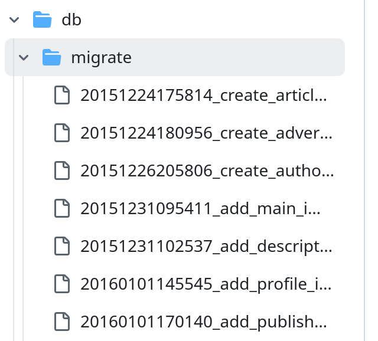

# Миграции

Из этой статьи вы узнаете:
- что такое миграции
- как с их помощью управлять структурой базы данных вашего приложения
- как создавать и использовать миграции в rails-приложении
- немного "лучших практик" по работе с миграциями

## База данных и её структура

При создании практически любого современого приложения нам понадобится база данных. Так или иначе, нам нужно будет хранить, записывать, обрабатывать данные. Например, заказы пользователей, информацию о поездках, тексты уроков, что угодно.

Чтобы работать с данными, нам нужна определённая структура, которую и предоставляет база данных. Но мы не можем задать эту структуру раз и навсегда. Наше приложение со временем будет развиваться, нам нужно будет не только добавлять, обновлять и удалять записи, но и менять структуру базы. Например, создавать новые таблицы или удалять ненужные, добавлять поля или менять их типы, создавать индексы и т.д.

На первый взгляд может показаться, что можно просто выполнить соответствующие sql-запросы (например, `alter table`, `create table`), и этого будет достаточно.
Но при таком подходе быстро возникнут проблемы:

- нужно будет вносить одни и те же изменения в копии баз данных на машинах других разработчиков (мы редко работаем над проектом в одиночку), на продакшен и стейдж-сервера. Вручную следить за этим будет неудобно.
- неудобно откатывать сделанные изменения в процессе разработки (если это потребуется)
- трудно отследить, как менялась структура базы данных со временем

Чтобы подобных проблем не возникало, используется механизм миграций.

### Миграции

**Миграции** - это способ управления изменениями структуры базы данных вашего приложения. Также миграциями называют сами файлы с описаниями изменений, которые вы хотите сделать. В том или ином виде механизм миграций есть во многих фреймворках (например, Django, Symphony), а не только в ruby on rails.

Иногда миграции пишут в sql-файлах:

```sql
CREATE TABLE users (
  id INTEGER PRIMARY KEY ,
  first_name VARCHAR(100),
  email VARCHAR(100)
);
```

или:

```sql
ALTER TABLE users
ADD birthday date; 
```

В ruby on rails миграции реализованы с помощью ActiveRecord, и мы пишем их прямо на Ruby с помощью DSL (Domain Specific Language, специального языка, созданного для этой цели).
Чтобы создать файл миграции, можно воспользоваться командой `rails generate` и передать ей название миграции, которое отражает суть изменений, которые вы хотите сделать:

```bash
bin/rails generate migration CreateUsers
```

Rails автоматически добавит метку времени к названию миграции, название файла будет в формате `20252205100843_create_users.rb`.
Метки времени определяют, в каком порядке будут выполнены миграции. (Это важно учитывать, если вы по какой-то причине редактируете название файла или копируете его из другого приложения). Rails хранит информацию о миграциях в таблице `schema_migrations`.  

[Больше о версионировании миграций в гайдах](https://guides.rubyonrails.org/active_record_migrations.html#rails-migration-version-control)

Директория `db/migrate` будет выглядеть примерно так:  



При создании файла миграции можно передать поля, которые хотите добавить, в качестве аргументов:  

```bash
$ bin/rails generate migration AddBirthdateToUsers birthday:date
```

Это не обязательно, и в любом случае, можно отредактировать файл после.  

Сами файлы миграций будут выглядеть так:

```ruby
# эта миграция создаст таблицу products
# db/migrate/20240502100843_create_products.rb
class CreateProducts < ActiveRecord::Migration[8.0]
  def change
    create_table :products do |t|
      t.string :name
      t.text :description

      t.timestamps
    end
  end
end
```
или  

```ruby
# эта миграция добавит поле к таблице products и индекс на это поле

class AddPartNumberToProducts < ActiveRecord::Migration[8.0]
  def change
    add_column :products, :part_number, :string
    add_index :products, :part_number
  end
end
```

### migrate

Чтобы применить изменения, нужно выполнить команду:

```bash
bin/rails db:migrate
```

Нам также нужно будет выполнить эту команду, когда мы подтянули из репозитория изменения, сделанные другими разработчиками (если появились новые миграции). При запуске приложения или тестов, rails нам об этом подскажет, если забыли.  

Также миграции нужно применить при деплое приложения на тестовый или продакшен-сервер.

### Откат миграций

Если нужно что-то поправить в миграции, мы не можем просто её отредактировать. Нужно сначала откатить изменения, потом накатить снова.
Для этого существует команда `db:rollback`.

Но обычно редактировать существующие миграции - не очень хорошая идея. Приемлемо только в том, случае, если вы только что создали миграцию (ещё не закоммитили её в систему контроля версий), и уже хотите её поменять. В таком случае команда `db:rollback` будет полезна.

В других случаях лучше создать новую миграцию.

### DSL и SQL в миграциях

В active record есть много [хелперов](https://guides.rubyonrails.org/active_record_migrations.html#updating-migrations) для изменений структуры бд.  

Если их недостаточно, можно написать SQL и выполнить его командой `execute`. Это обычно не требуется, но важно понимать, что такая возможность есть.
В таком случае, чтобы миграция была обратимой, нужно явно прописать логику в методе `down`.  


```ruby
class CreateCarUsers2 < ActiveRecord::Migration[8.0]
  def up
    execute "CREATE TABLE cars_users2 AS SELECT DISTINCT * FROM cars_users;"
  end

  def down
    execute "DROP TABLE cars_users2;"
  end
end
```

### Изменение данных, а не структуры

Иногда нам нужно поменять существующие данные, а не только структуру базы данных. Лучше сделать это в дата-миграциях, и не смешивать изменения структуры бд и изменение данных. Например, с помощью гема `data-migrations`. Так изменения структуры и данных будут логически отделены в приложении.

Также не стоит использовать код приложения, например, вызывать методы моделей в миграциях. Со временем код приложения может поменяться и миграции будут падать с ошибкой.

### Вывод

Миграции помогают нам:
- вносить изменения в структуру базы данных нашего приложения
- синхронизировать эти изменения между машинами разработчиков, тестовыми и production-серверами
- отслеживать изменения структуры базы данных с развитием нашего приложения